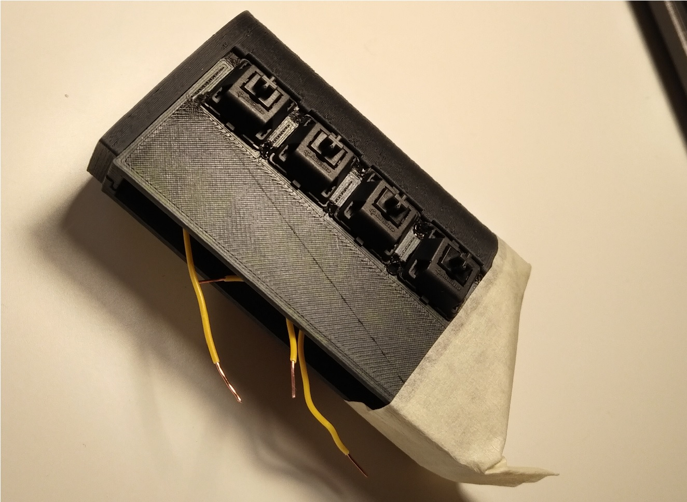

# Project Accordian
Are you lazy? I am. I have decided that I can no longer be bothered to move my fingers when typing (which I do a lot). The only solution: design a new keyboard.

Okay, it stems from more than pure laziness, but its close to the truth. I want a more efficient keyboard workflow that can be easily applied to a portable device and still be as fully featured as a full ~100 key keyboard.

The solution? Project Accordian! Left four fingers select the set of keys to type from (A-H for example), right four fingers can be used to type. This gives a possible (2^4 * 8) easy-to-access key combinations, pleanty to access the full power of a normal keyboard. Modifier keys (ctrl, shift, alt, super) can be accessed via the four thumb keys (four per thumb for combination convenience).

The name stems from the device's similarity in operation to an accordian (as pointed out by a colleague).

The source for the arduino code, the electronic circuit diagram, and the 3D printable body mesh will be uploaded here.

# Useful links

Learning to type on a new keyboard is an arduous task (do you remember how slow you were when you first touched a QWERTY keyboard?). Here are a few links that could be handy.

* [Typing Cat](http://thetypingcat.com/)

* [Kebr](https://www.keybr.com/)

# Timeline

## Arduino breadboard test

First step was to get to know the arduino system (I'd never even touched one until this project). Turns out its incredibly simple thanks to the incredible IDE and the fantastic libraries available.

## Serial test

Once I'd written some barebones code and hooked up some keyboard switch modules, I tested to see if the keyboard library available for arduino worked (and if I'd written everything okay). Success! I can type things.

## Prototype V1

With the code written, I quickly designed a hardware shell (in Fusion 360) and printed it out (on my Anet A8). The result is the horrifyingly ugly prototype v1 above. Ugly, but functional! A little crab-like in the manner of holding it, but at least it can be used. The system is complete! Now to improve it so its not a fiddle POS.

## Prototype V2

For this prototype, I thought about sticking a Raspberry Pi 3 with a 3.5" screen in between the two handles of Project Accordian, thus giving a portable full desktop computer, in a form-factor similar to a Nintendo switch, Sony PSP, or any of the other myriad similar designs. However, I ran into a few problems. It appears the power supply I have cannot supply enough juiuce to power the screen and Pi together. I then tried to do the same with a RPi-Z but had issues getting the LCD driver to work properly. Finally, I gave up and we end up with the PSP shaped keyboard with no screen. Upshot? The extra space I had to add to account for the RPi-3 makes it quite comfortable to hold! Getting closer to a final design!
